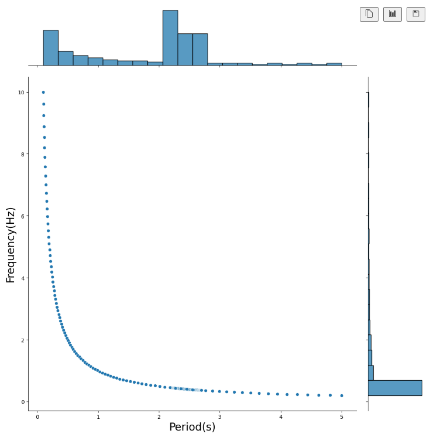
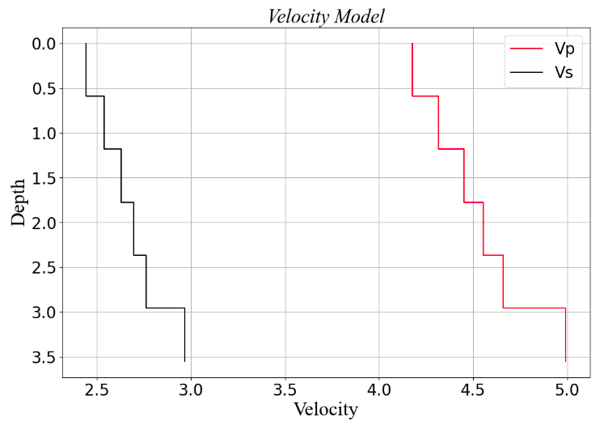
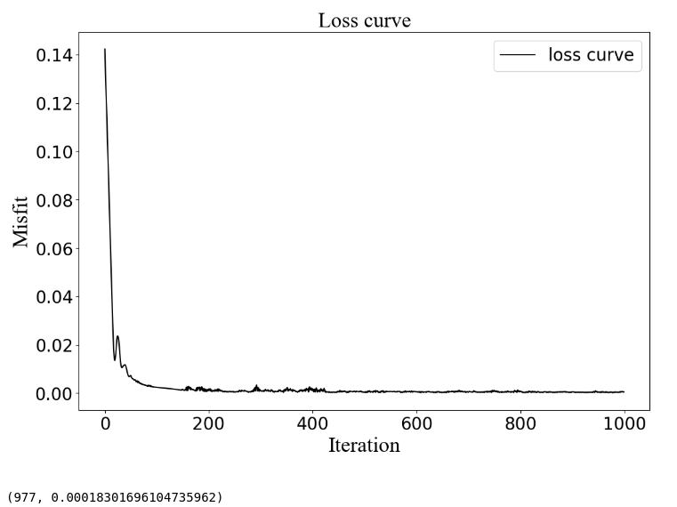
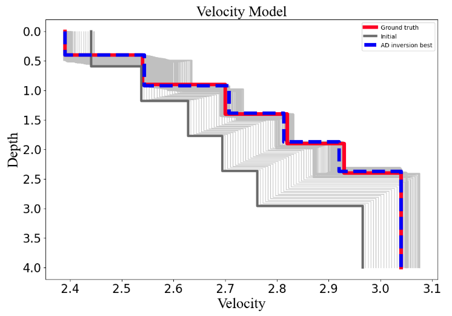
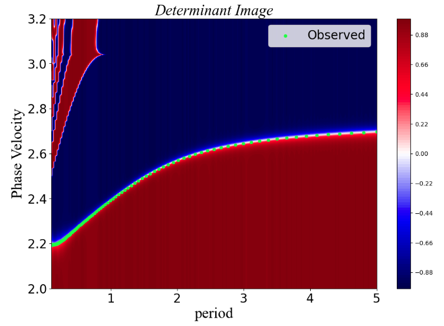
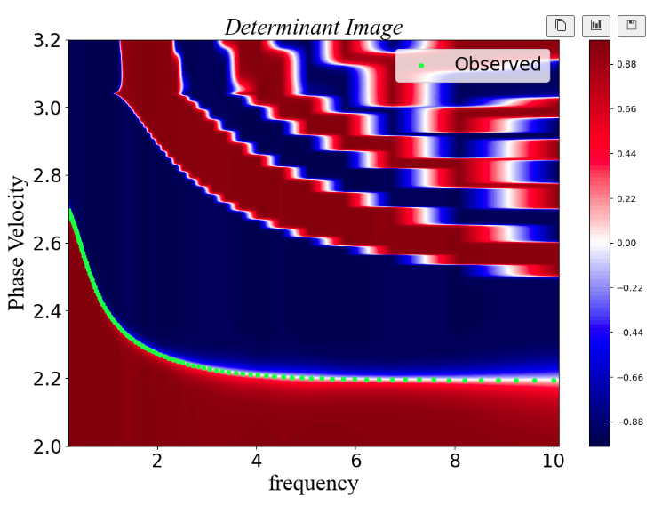

# ADsurf: Multimodal surface wave inversion tool based on automatic differentiation (AD)

<b >ADsurf</b> is a computationally efficient python program for the multimodal surface wave inversion and implementation for [Pytorch](https://pytorch.org/). The implementation follows a open source python project named [disba](https://github.com/keurfonluu/disba) which is an efficient tools for modeling of surface wave dispersion and implements from [Computer Programs in Seismology(CPS)](https://www.eas.slu.edu/eqc/eqccps.html)). We have reconstruct the forward-pass that it can solve the inverse gradients by AD automatically, and a new determint misfit function used in our program to make it applicable to multimodal dispersion curves inversion.

By Liu Feng @ USTC, Email: liufeng2317@mail.ustc.edu.cn

## 1.Install
We recommend building a new environment to run the code, and anaconda can be used to help you:
```python
conda create --name ADsurf python==3.8
```
some requirements package need to be installed:
```python
pip install -r requirements.txt
```
We recommend using the GPU version of Pytorch to maximize the efficiency of the surface wave inversion.

```python
conda install pytorch torchvision torchaudio pytorch-cuda=11.6 -c pytorch -c nvidia
```
more details can be found in [Pytorch instal](https://pytorch.org/)

## 2. run demo
The follwing is an example of how to inversion with ADsurf. More examples and details will found in Jupyter notebook:
### 1. Preparing the dispersion data
the observed dispersion data need to be orginized by a 2-D matrix: the first column is the `period (s)` or `frequency (Hz)`； and the second column is the observed `phase velocity (km/s)`;

| period (s) 	| Phase Velocity (km/s) 	|
|------------	|-----------------------	|
| 0.1        	| 2.19482374            	|
| 0.10403065 	| 2.19485283            	|
| 0.10822376 	| 2.19489002            	|
| 0.11258588 	| 2.19494247            	|
| 0.11712383 	| 2.19501066            	|
| 0.12184468 	| 2.19510221            	|



### 2. Setting the model paramters and inversion paramters
Details of all the paramters can be fond in [jupyter notebooks]("./00_test_increase.ipynb")

the key paramters including 
`Learning rate` : the step size for inversion
`damp`: including the damping of verticle and horizontal(only for 2-D and 3-D inversion)
`layering method`: the initializing method provide by ADsurf. 

### 3. Model initializing
We provide two commond used layering method named Layering by ratio(LR) and Layering by Number (LN) for uses, more details can be found in [Cox and Teague (2016)](https://academic.oup.com/gji/article/207/1/422/2583608)



### 4. Inversion
we have built a complete object-oriented programs:
```python
inversion_model = inversion(
                        model_param = model_parameter,
                        inv_param = inversion_parameter,
                        init_model=initial_model,
                        pvs_obs=pvs_obs,
                        vsrange_sign="mul",
                        vsrange=[0.1,2],
                        AK135_data=[],
                        device="Cuda"
                        )
```




### 5. Inverted dispersion curves



### 6. result saving
You can save all the intermediate processes and results of the inverson.

## Contributing
Contributions are welcom [.disba](https://github.com/keurfonluu/disba) and [Computer Programs in Seismology (CPS)](http://www.eas.slu.edu/eqc/eqccps.html).

## License
The ADsurf package is distributed under the [MIT license]("./LICENSE") (free software).