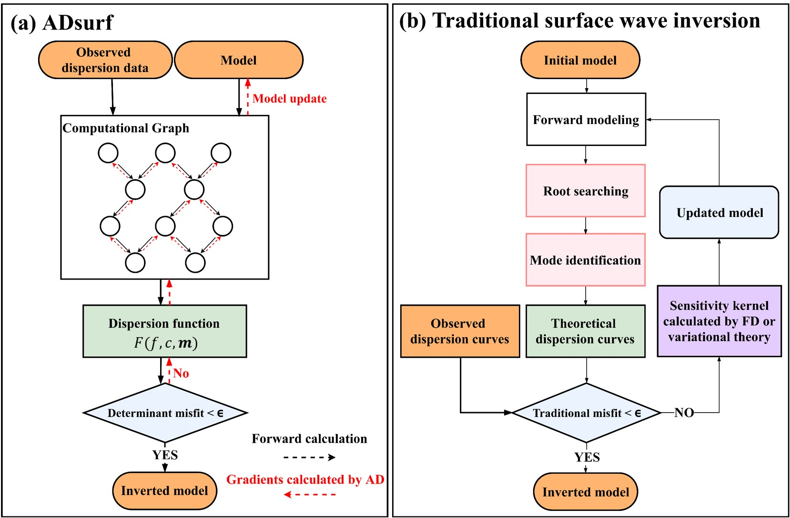
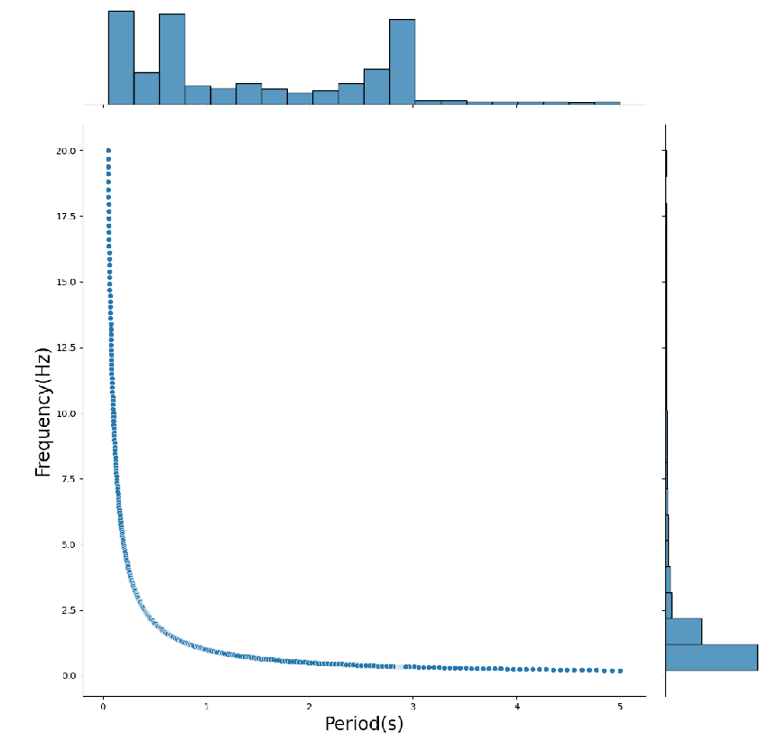
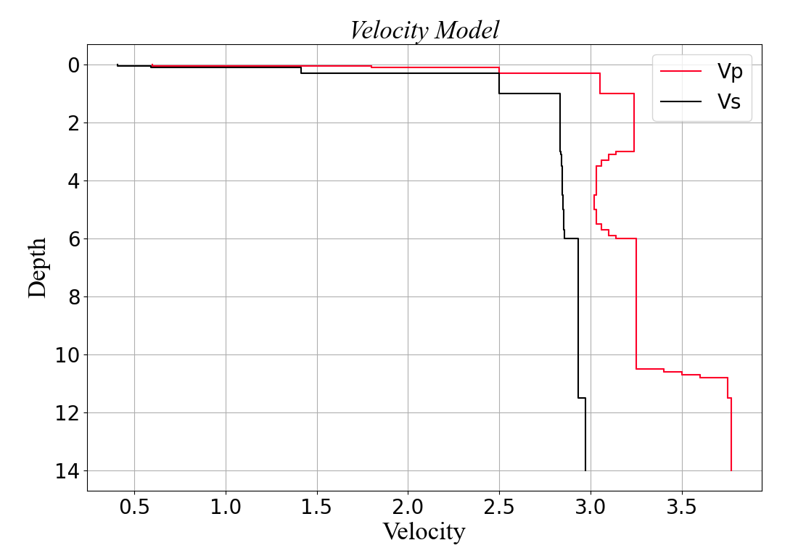
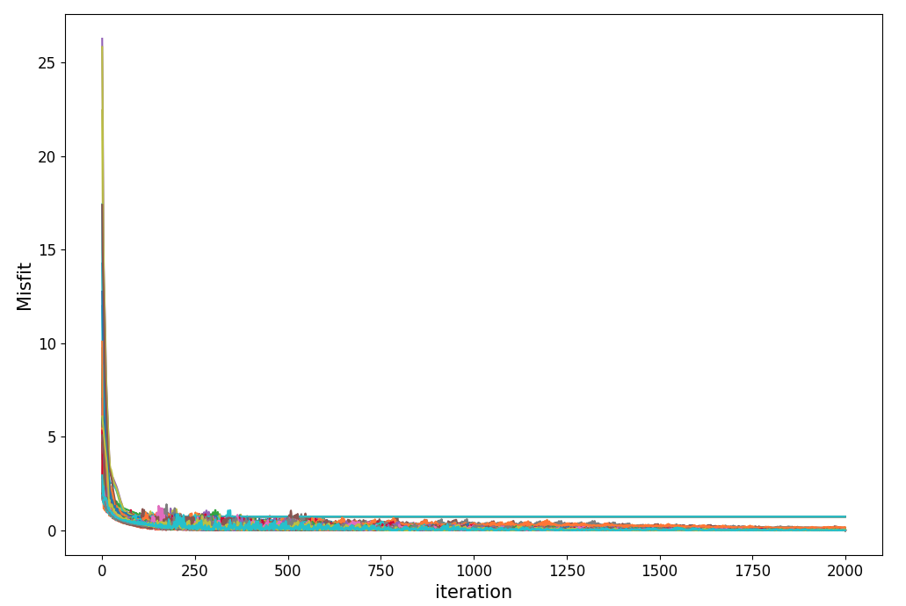
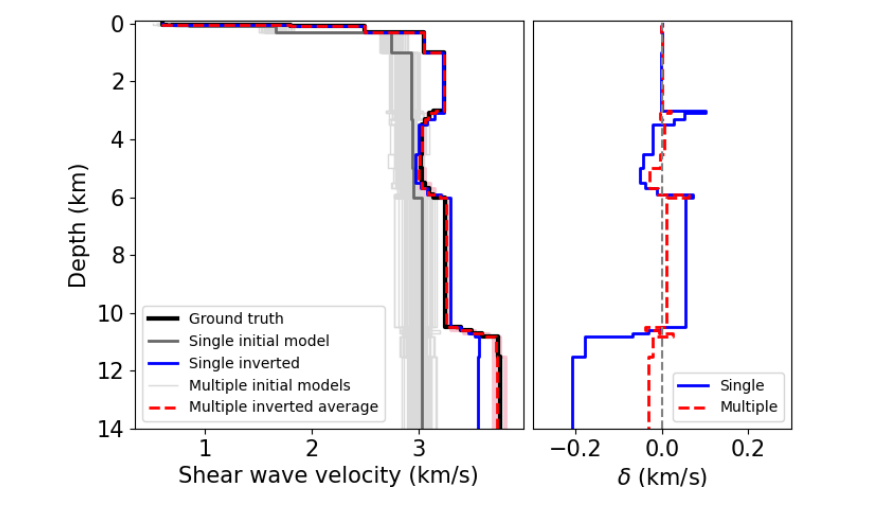
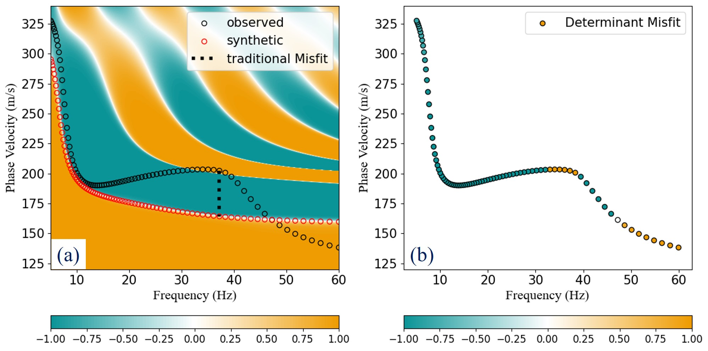
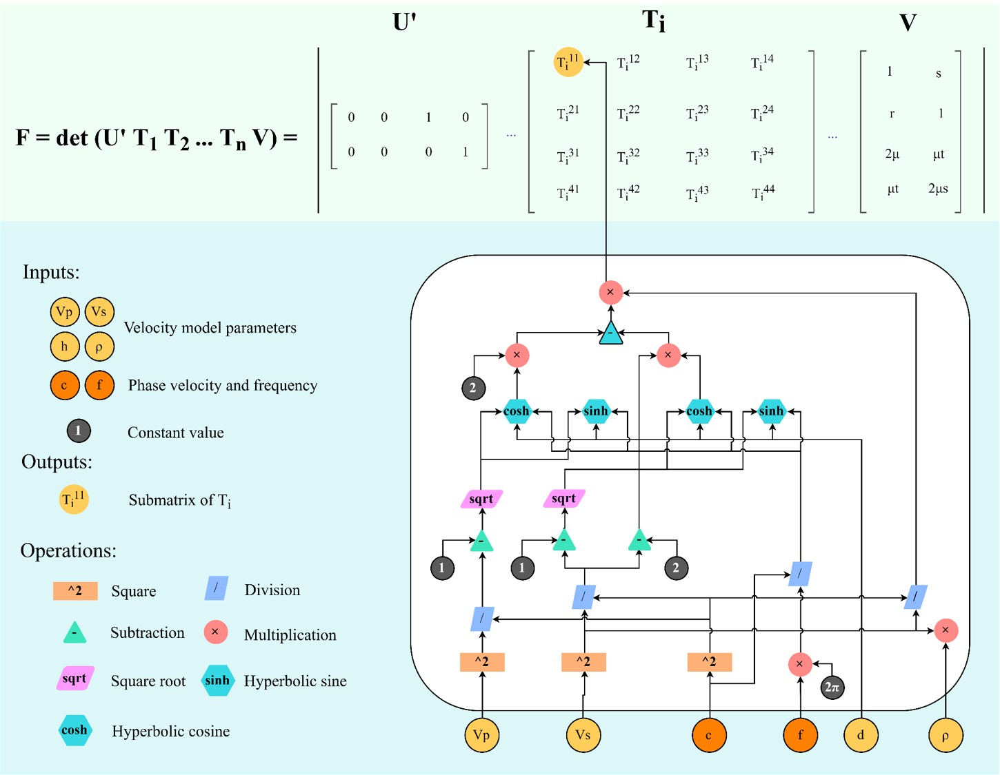
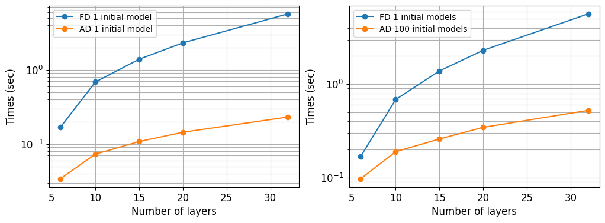
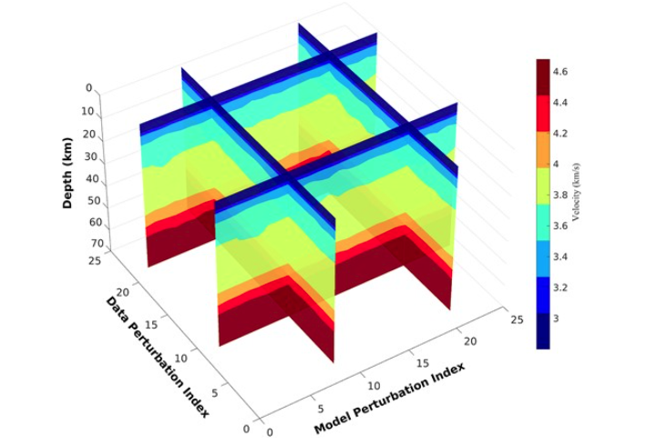

<!--
 * @Author: LiuFeng(USTC) : liufeng2317@mail.ustc.edu.cn
 * @Date: 2023-02-10 17:39:49
 * @LastEditors: LiuFeng
 * @LastEditTime: 2024-05-22 00:13:14
 * @FilePath: /AD_github/README.md
 * @Description: 
 * Copyright (c) 2023 by ${git_name} email: ${git_email}, All Rights Reserved.
-->
# ADsurf: Multimodal surface wave inversion with automatic differentiation

> &nbsp;&nbsp; <font face="微软雅黑" size=6><b >ADsurf</b> is a computationally efficient python program for the multimodal surface wave inversion and implementation for [Pytorch](https://pytorch.org/). The implementation follows a open source python project named [disba](https://github.com/keurfonluu/disba) which is an efficient tools for modeling of surface wave dispersion and implements from [Computer Programs in Seismology(CPS)](https://www.eas.slu.edu/eqc/eqccps.html)). We have reconstruct the forward-pass that it can solve the inverse gradients by AD automatically, and a new determint misfit function used in our program to make it applicable to multimodal dispersion curves inversion.</font>

<div align="center"></div>

****

## Installation
<font face="微软雅黑" size=4> Step1: We recommend building a new environment to run the code, and anaconda can be used to help you:</font>
  ```python
  conda create --name ADsurf python==3.8
  ```

<font face="微软雅黑" size=4> Step2: Some requirements package need to be installed:</font>
```python
pip install -r requirements.txt
```

<font face="微软雅黑" size=4> Step3: We recommend using the GPU version of Pytorch to maximize the efficiency of the surface wave inversion.</font>
```python
conda install pytorch torchvision torchaudio pytorch-cuda=11.6 -c pytorch -c nvidia
```

<font face="微软雅黑" size=4>More details can be found in [Pytorch instal](https://pytorch.org/)</font>

****

## Examples
<font face="微软雅黑" size=4> The follwing is an example of how to inversion with ADsurf. More examples and details will found in Jupyter notebook</font>

<details>

### 1) Preparing the dispersion data
the observed dispersion data need to be orginized by a 2-D matrix: the first column is the `period (s)` or `frequency (Hz)`； and the second column is the observed `phase velocity (km/s)`;

| period (s) 	| Phase Velocity (km/s) 	|
|------------	|-----------------------	|
| 0.1        	| 2.19482374            	|
| 0.10403065 	| 2.19485283            	|
| 0.10822376 	| 2.19489002            	|
| 0.11258588 	| 2.19494247            	|
| 0.11712383 	| 2.19501066            	|
| 0.12184468 	| 2.19510221            	|
| ... 	| ...            	|

<div align="center"></div>

### 2) Setting the model paramters and inversion paramters
Details of all the paramters can be fond in [jupyter notebooks]("./00_test_increase.ipynb")

the key paramters including 

- `Learning rate` : the step size for inversion
- `damp`: including the damping of verticle and horizontal(only for 2-D and 3-D inversion)
- `layering method`: the initializing method provide by ADsurf. 

### 3) Model initializing
We provide two commond used layering method named Layering by ratio(LR) and Layering by Number (LN) for uses, more details can be found in [Cox and Teague (2016)](https://academic.oup.com/gji/article/207/1/422/2583608)

<div align="center"></div>

However, it should be noted that linear inversion inevitably tends to fall into local minima, and to address this problem we try to initialise several initial velocity models simultaneously for simultaneous inversion (**Monte Carlo method**).

More detail and comparation will discuss in Inversion part.

### 4) Inversion
we have built a complete object-oriented programs:
```python
inversion_model = inversion(
                        model_param = model_parameter,
                        inv_param = inversion_parameter,
                        init_model=initial_model,
                        pvs_obs=pvs_obs,
                        vsrange_sign="mul",
                        vsrange=[0.1,2],
                        AK135_data=[],
                        device="Cuda"
                        )
```

The misfit decay with the iteration, We should note that although we have up to 2000 iterations here, the number can be reduced to 100 or less with parameter adjustment.
<div align="center"></div>

Although you can choose between inversion using the MonteCarlo multi-initial velocity model and inversion using just the single-initial velocity model, we recommend that you use the Monte Carlo inversion because you can get better results with little additional computational overhead.

<div align="center"></div>

### 5) result saving
You can save all the intermediate processes and results of the inverson.

</details>

****

## Related Knowledges
> <font face="微软雅黑" size=4>Please refer to the article for theoretical details: [Multimodal surface wave inversion with automatic differentiation](https://doi.org/10.1093/gji/ggae155)</font>

<details>

### 1) Determinant Misfit Function v.s. Traditional Misift Function

<div align="center"></div>

### 2) Automatic Differentiation and Computational Graph
<div align="center"></div>

### 3) Efficiency of surface wave inversion with automatic differentiation
<font face="微软雅黑" size=4> We compared the computational efficiency of ADsurf and finite difference methods (FD) for inversion (it should be noted that we used the Determinant Misfit Function(DMF)) </font>

<div align="center"></div>

### 4）Analysis of inversion uncertainties
<font face="微软雅黑" size=4> We provide a more detailed description of how to use ADsurf to assess the inversion uncertainty due to the initial model and observations in the APPENDIX-E section of the main text.</font>

<div align="center"></div>

</details>

****

## Contributing
<font face="微软雅黑" size=4> Contributions are welcome [.disba](https://github.com/keurfonluu/disba) and [Computer Programs in Seismology (CPS)](http://www.eas.slu.edu/eqc/eqccps.html).</font>


## License
<font face="微软雅黑" size=4> The ADsurf package is distributed under the [MIT license]("./LICENSE") (free software). </font>

## Citation
<font face="微软雅黑" size=4> If you find ADsurf useful, please cite the following reference: </font>

[Feng Liu, Junlun Li, Lei Fu, Laiyu Lu, Multimodal surface wave inversion with automatic differentiation, Geophysical Journal International, Volume 238, Issue 1, July 2024, Pages 290–312, https://doi.org/10.1093/gji/ggae155](https://doi.org/10.1093/gji/ggae155)

## Contact
 Liu Feng @ USTC, Email: liufeng2317@mail.ustc.edu.cn

```python
@software{LiuFeng2317,
  author       = {Feng Liu},
  title        = {TorchInversion},
  month        = July,
  year         = 2023,
  version      = {v1.0.0},
}
```
